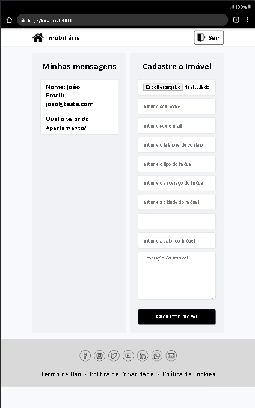

# Imagens PC


# Imagens Mobile
<div>
  
  
  
</div>

# Imagens Tablet
<div>
  
  
</div>

## Testes de rotas usando o framework Insomnia


## Diagrama Entidade Relacionamento no MySQL


## Iniciar o front-end
```
npm start
```

## Iniciar o back-end
```
yarn dev
```

## Gerar db Prisma
```
yarn prisma migrate dev
```

## Extensões VS Code
* `Auto import`
* `Axios Snippets`
* `Code Runner`
* `ES7+ React/Redux/React-Native snippets`
* `Material Icon Theme`
* `Prisma`
* `vscode-styled-components`
